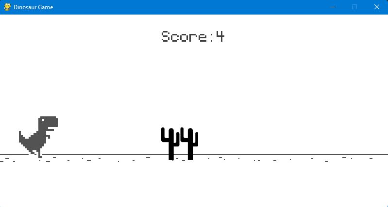
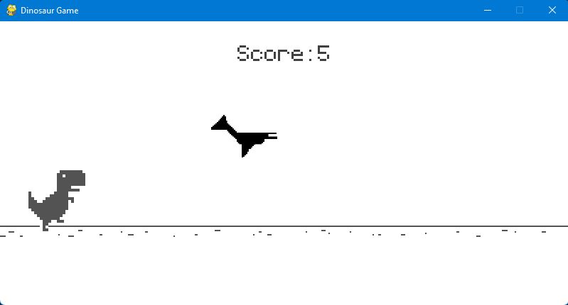

# DinoGame with Python

It is a cloned version of the chrome dinosaur game written in Python with the Pygames module.\
This is my first python game 😊.

## Here's how it looks-like

## How to Run the project on your Device

First step is install latest version of Python on your device.\
In the project directory, you can run the following in your terminal (powershell recommended):

### `pip install requirements.txt`

Runs the python pakage manager pip which gets automatically installed along with python.\
This installs the dependencies of the project.

### `python game.py`

This is the final step.\
Runs the gamefile.
